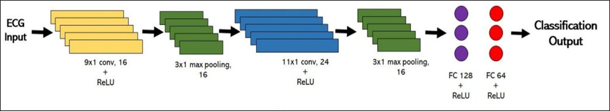

## Clasificación de arritmias en ECG con CNN 1D

Este repositorio contiene un ejemplo sencillo de **clasificación de arritmias en señales ECG** usando una **CNN 1D** implementada en el notebook `CNN_ECG_Workshop.ipynb`.

### ¿Qué incluye?

- Notebook `CNN_ECG_Workshop.ipynb` con:
  - carga de las señales ECG desde `dataset/`,
  - preprocesamiento básico,
  - definición, entrenamiento y evaluación de la CNN 1D.
- Carpeta `dataset/` con los conjuntos de entrenamiento, validación y prueba.
- Carpeta `assets/` con la figura de la arquitectura de la red.

El modelo entrenado (`CNN_ECG_model.h5`) se distribuye como **asset de una Release** en GitHub y debe colocarse en la carpeta `model/` para usarlo desde el notebook.
